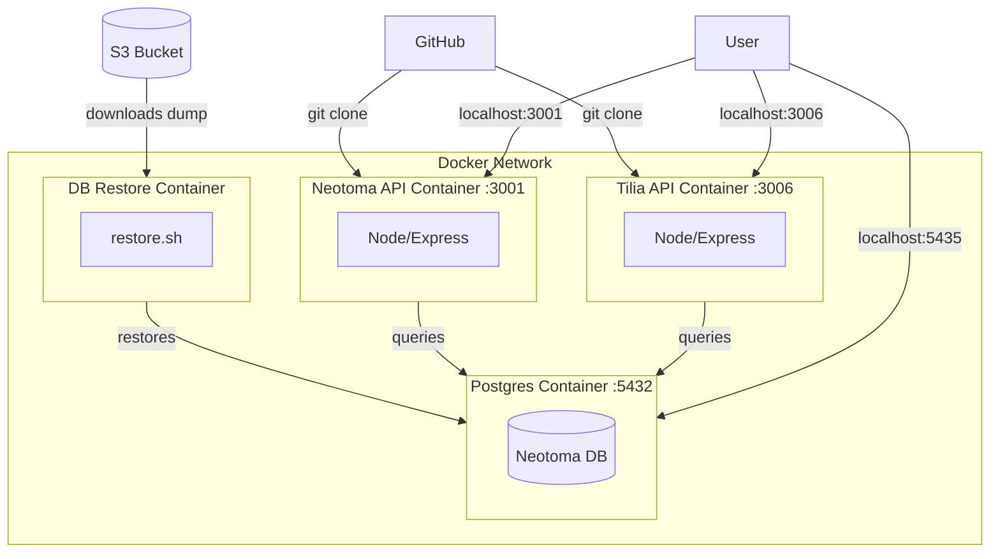

[](https://lifecycle.r-lib.org/articles/stages.html#stable)

# Neotoma Application Stack

This Docker Compose application is designed to mimic the full Neotoma Stack, including a clean version of the Neotoma Database (all personal data has been anonymized). We combine a "clean" version of the Neotoma database, with both the Tilia and Neotoma APIs.

The stack downloads the "clean" tar file from our repository, and installs it into the container, and then pulls in both the apis from Github, building them with Node/yarn.  Once the container is deployed the following ports will be active:

* `5435`: Neotoma Postgres Database
* `3001`: Neotoma API
* `3006`: Tilia API

The goal of this stack is to allow advanced users to develop tools for Neotoma on their local machines without impacting production services. It also allows users to modify the API or Tilia source code, and to pull from GitHub forks of these resources by modifying the `.env` file to point to different code sources, branches, or forks.



## Contributors

* [Simon Goring](http://goring.org): University of Wisconsin - Madison [](https://orcid.org/0000-0002-2700-4605)
* Socorro Dominguez: University of Wisconsin - Madison [](https://orcid.org/0000-0002-7926-4935)

## Contribution

We welcome user contributions to this project.  All contributors are expected to follow the [code of conduct](code_of_conduct.md).  Contributors should fork this project and make a pull request indicating the nature of the changes and the intended utility.  Further information for this workflow can be found on the GitHub [Pull Request Tutorial webpage](https://help.github.com/articles/about-pull-requests/).

## Using This Repository

To use this repository, first clone the repository to your local computer:

```bash
git clone 
```

Once the repository is cloned you can simply execute:

```bash
docker compose up
```

This will then make the main Neotoma API available through port `3001`, the Tilia API available through port `3006`, and the Neotoma database available at port `5435`. Given this, `localhost:3001` should provide the same result as [`https://api.neotomadb.org`](https://api.neotomadb.org).

### Docker Structure

The main `docker-compose.yaml` defines the main components within the Docker container. It includes environments for each API and for the database itself. We isolate the difference components so that we can manage and manipulate them independently as we work on building the toolset.

#### clean_database

This folder contains the Dockerfile used to manage the downloading and extraction of the Neotoma database to the Docker container. The dockerfile and the `db_restore.sh` script should act as a model for users who wish to simply run the Neotoma database within a Docker container. Because the database is relatively large, and restoring the database takes some time, there are elements within the script to check for prior downloads, and to check for successful restoration.

You can use this repository/docker compose file to restore only the database using the command:

```bash
docker compose up postgres db-restore
```

If you have successfully restore the database within the container before you may see the statement:

```bash
db-restore-1  | [restore] Database already restored. Skipping.
db-restore-1 exited with code 0
```

This is simply a statement that the database has been properly restored, and not an error message.

Once the database is restored and the container is available, you can access it with your database program at post `5435`


#### api_nodetest

This folder contains the Dockerfile to clone and initialize the Neotoma API.

#### tilia_api

This folder contains the Dockerfile to clone and initialize the Tilia API.
